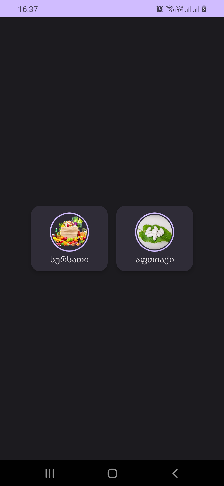
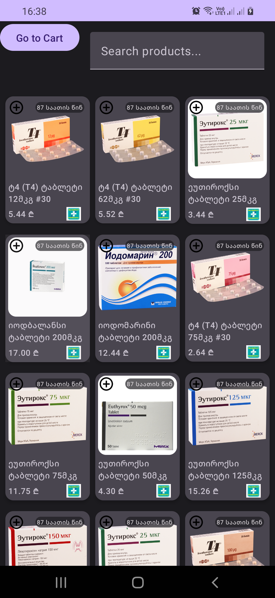
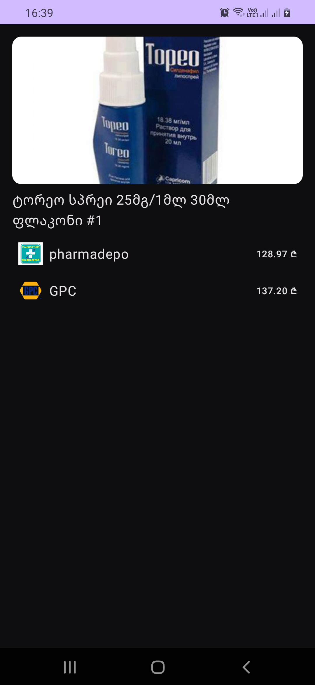
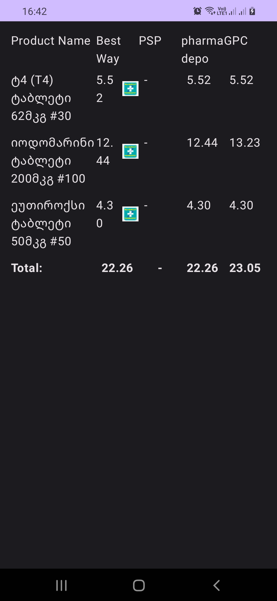

# ForSalesApp

ForSalesApp is an Android application that helps users compare grocery prices from different markets and find the best deals for their shopping. The app provides real-time price comparisons, allowing users to make informed purchasing decisions.

## Features

- **Price Comparison**: Easily compare prices of products across multiple stores.
- **Real-Time Updates**: Prices and product information are updated in real-time.
- **Modern UI**: Built using Jetpack Compose for a sleek and intuitive user experience.
- **Detailed Product View**: View product details, including prices across different stores.
- **Product Cart**: Add items to your cart and see the total cost from each store.

## Screenshots

### Home Screen

### Product Detail Screen

### Product Cart

## Technologies Used

- **Frontend**: Kotlin, Jetpack Compose
- **Backend**: Django (for data retrieval)
- **Database**: MS SQL Server (to store product data)
- **Data Parsing**: Python Selenium (to scrape and parse product data)
- **Other**: 
  - Retrofit for API calls
  - Coil for image loading
